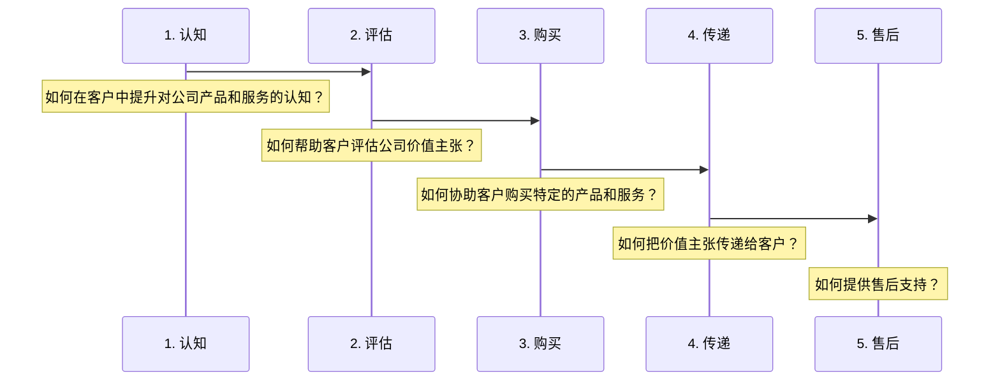

# 商业模式新生代
**Business Model Generation**，中文书名为《商业模式新生代》，是一本介绍如何设计和重构创新商业模式的工具书。书中提供了**商业模式画布**这一简单有效的工具用于理解、设计、重塑和实施商业模式。全书分为七个部分：
- **画布：** 介绍了商业模式的定义，以及如何构造一种用于描述、分析、设计商业模式的工具，商业模式画布（Business Model Canvas）。
- **式样：** 利用商业模式画布分析了五种基于领先商业思想家理念的商业模式式样（Business Model Patterns）及典型案例。
- **设计：** 介绍了用于设计商业模式的技术方法。
- **战略：** 分析影响商业模式的市场环境，并通过商业模式视角重新解读企业战略。
- **流程：** 对前面几个部分提及的概念、方法和工具的总结，归纳了一套帮助设计创新商业模式的通用流程。
- **展望：** 介绍了可供探讨的五个关于商业模式未来展望的主题。
- **后记：** 介绍本书的创作过程，也是一个非典型的商业模式介绍。

[TOC]

# 一.  画布
## 1.1 商业模式
### 1. 定义
商业模式描述了企业如何创造价值、传递价值和获取价值的基本原理。
商业模式画布(Business Model Canvas)是一种用来描述商业模式、可视化商业模式、评估商业模式以及改变商业模式的通用语言。
### 2. 组成
商业的4个主要方面：**客户**、**提供物（产品/服务）**、**基础设施**和**财务生存能力**。
商业模式的9个**构造块(Building Blocks)**：
- **CS 客户细分**(Customer Segments)
- **VP 价值主张**(Value Propositions)
- **CH 渠道通路**(Channels)
- **CR 客户关系**(Customer Relationships)
- **R$ 收入来源**(Revenue Streams)
- **KR 核心资源**(Key Resources)
- **KA 关键业务**(Key Activities)
- **KP 重要合作**(Key Partnerships)
- **C$ 成本结构**(Cost Structure)

## 1.2 客户细分
### 1.定义
**客户细分**(Customer Segments)构造块用来描绘一个企业想要接触和服务的不同人群或组织。
### 2. 划分标准
客户群体按照如下标准划分为独立的客户细分群体：
- 需要和提供明显不同的提供物（产品/服务）来满足客户群体的需求；
- 客户群体需要通过不同的分销渠道来接触；
- 客户群体需要维系不同类型的客户关系；
- 客户群体的盈利能力（收益性）有本质区别；
- 客户群体愿意为提供物（产品/服务）的不同方面付费。
### 3. 典型分类
核心问题：我们正在为谁创造价值？谁是我们最重要的客户？
- **大众市场（Mass market）**：价值主张、渠道通路和客户关系聚焦于具有大致相同需求和问题的一个大范围客户群组。
- **利基市场（Niche market）**：价值主张、渠道通路和客户关系都迎合特定的客户细分群体的特定需求定制。
- **区隔化市场（Segmented market）**：价值主张、渠道通路、客户关系和收入来源在客户需求及困扰（needs and problems）不同的市场细分群体间有区别。
- **多元化市场（Diversified market）**：能够以完全不同的价值主张来迎合具有不同需求和困扰的客户细分群体。
- **多变平台/多边市场（Multi-sided platforms/multi-sided markets）**：服务于两个或更多的相互依存的客户细分群体。

补充说明：
菲利普凯特勒给利基市场下的定义是高度专门化的需求市场，被剧透忽略或者没有被服务好的市场，“有获取利益的基础”。用现在的互联网词汇来参照就是垂直细分领域。
多元化市场：亚马逊弹性云计算服务P25

## 1.3 价值主张
### 1. 定义
**价值主张**(Value Propositions)构造块用来描绘为特定客户细分创造价值的系列产品和服务。

每个价值主张都需要解决用户痛点或满足细分群体的客户需求(customer problems/needs)。每个价值主张都包含可选系列产品或服务。价值可以是定量的（如价格、服务速度），也可以是定性的（如设计、客户体验）。不同的价值主张可以归为以下三类（**个人分类，非书中概念**）：
- **破坏性/颠覆性主张**：完全创新或破坏性的提供物（产品/服务）
- **微创新主张**：与现存市场提供物（产品/服务）类似，增加功能和特性
- **竞品主张**：竞争企业为抢占市场而推出的同质化市场提供物（产品或服务）

### 2. 要素
核心问题：
我们该向客户传递什么样的价值？
我们正在帮助我们的客户解决哪一类难题？
我们正在满足哪些客户需求？
我们正在提供给客户细分群体哪些系列的产品和服务？

创造价值的几大要素：

- **新颖(Newness)**：满足客户从未感受和体验过的全新需求。
- **性能(Performance)**：改善产品和服务性能。
- **定制化/客户参与(Customization)**：定制产品和服务以满足个别客户或客户细分群体的特定需求。
- **把事情做好(Getting the job done)**：帮客户把事情做好。
- **设计(Design)**：优秀设计带来的价值，常见于时尚和消费电子产品工业。
- **品牌/身份地位(Brand/status)**：客户可以通过使用和显示某一特定品牌而发现价值。
- **价格(Price)**：以更低的价格提供同质化的价值，满足价格敏感客户细分群体的核心需求。
- **成本削减(Cost reduction)**：帮助客户削减成本。
- **风险抑制(Risk reduction)**：帮助客户抑制购买产品和服务的风险。
- **可达性(Accessibility)**：把产品和服务提供给以前接触不到的客户。
- **便利性/可用性(Convenience/usability)**：使事情更方便或易于使用可以创造可观的价值。

补充说明：
便利性/可用性：苹果公司的iPod和iTunes为用户提供了在搜索、购买、下载和收听数字音乐方面前所未有的便捷体验，并借此占据主导了市场。P29

## 1.4 渠道通路
### 1. 定义
**渠道通路**(Channels)构造块用来描绘公司是如何沟通、接触其客户细分而传递其价值主张。

渠道通路作为公司和客户的接口，在提升客户体验方面有重要作用，具体包含以下功能：
- 提升公司产品和服务在客户中的认知；
- 帮助客户评估公司的价值主张；
- 协助客户评估公司价值主张；
- 向客户传递价值主张；
- 提供售后客户支持。

### 2. 分类
企业组织的市场渠道包括自有渠道、合作伙伴渠道或者两者混合。

|渠道类型|自有渠道|合作伙伴渠道|
|------------- | -------------|-------------|
**直接渠道**|内部直销团队/在线销售|/
**非直接渠道**  |自有零售商店|分销批发/合作伙伴零售商店/合作伙伴网站|

两者也是各有利弊。
|渠道比较|自有渠道|合作伙伴渠道|
|-----|-----|-----|
|优点|利润更高|优势互补，扩展接触客户的范围，从而扩展收益|
|缺点|建立和运营成本都很高|更低的利润|

在把价值主张推向市场期间，需要发现接触客户的正确渠道组合。渠道管理的诀窍是在不同类型渠道之间找到平衡点，并整合它们来优化客户体验，同时使收入最大化。

### 3. 阶段
渠道阶段序列图（序列图采用[mermaid语法](http://knsv.github.io/mermaid/index.html)）。

### 4. 核心问题
通过哪些渠道可以接触我们的客户细分群体？
我们现在如何接触他们？我们的渠道如何整合？
哪些渠道最有效？哪些渠道成本效益最好？
如何把我们的渠道与客户的例行程序进行整合？
